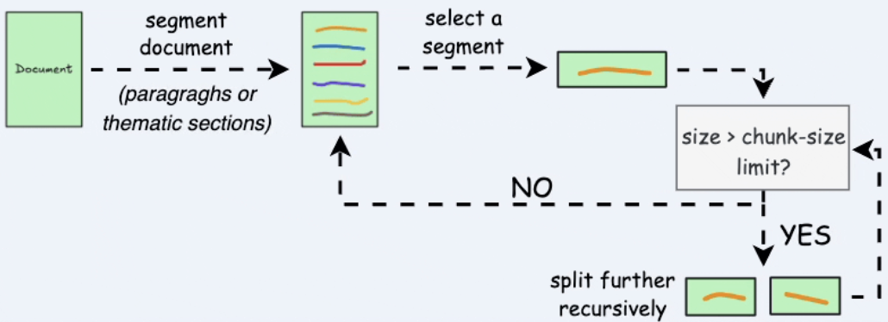
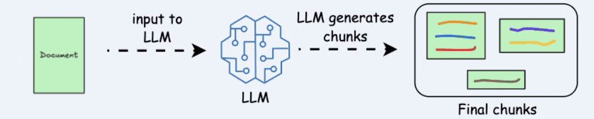
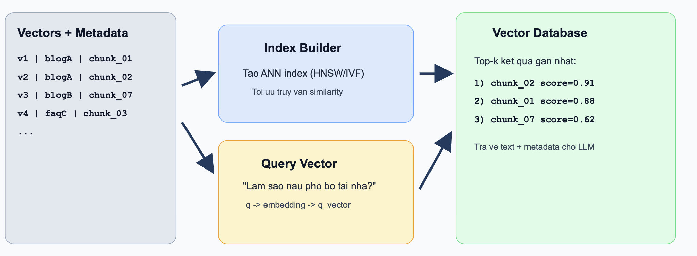

# Retrieval: The Universal Key in the Age of AI (Full Merged EN Version)

> This file is the full merge of parts 2, 3, 4, and 5.

---

## 2. From Keywords to Meaning: How AI Changed the Way We Search  
*(Perspective of an NLP Engineer)*

Let’s imagine you go to Google and type “how to lose weight effectively”. This is a very common example, but it helps us understand how search systems have evolved over time.

### Traditional approach: keyword-based search

In the past, search systems worked in a fairly straightforward way: they looked for documents that contained the exact words you typed, such as “lose weight” or “effective”.

- Documents that contained these keywords more frequently were usually ranked higher.
- Documents that did not include those exact words, even if they were relevant, could be ranked lower or ignored.

In other words, the system focused on matching words rather than understanding the actual content.

### The limitation of this approach

Consider an article titled “How to stay fit and burn fat safely”. The content is clearly related to losing weight and improving health.

However, because it does not explicitly include the phrase “lose weight”, a traditional search system might not rank it highly. As a result, users could miss useful information simply because of different wording.

### A new approach: semantic search

Modern systems take a different approach. Instead of only matching keywords, they try to understand the user’s intent behind the query.

- When you search for “lose weight”, the system may interpret it more broadly as interest in fat burning, healthy eating, or exercise.
- This allows it to return results that may not share the same words, but are still highly relevant.

The key difference here is that the system is no longer just “reading words”, but starting to “understand meaning”.

### A simple way to think about it

One way to visualize this is to imagine that each sentence or paragraph is represented based on its meaning.

- Content with similar meanings is placed close together.
- Content with different topics is placed further apart.

For example, phrases like “lose weight”, “burn fat”, and “eat clean” all relate to a similar concept, so they are considered close to each other, even though they use different words.

### A quick comparison

| Approach | Main idea | When it works best |
|---------|----------|------------------|
| Keyword-based | Matches exact words | When searching for specific terms like product names or code |
| Semantic search | Understands meaning | When asking questions or exploring general knowledge |

Each approach has its own strengths and limitations.

### What happens in practice today

In real-world systems, these two approaches are often combined rather than used separately.

- Keyword matching helps ensure precision at the surface level.
- Understanding meaning helps improve relevance and flexibility.

This combination allows systems to deliver results that are both accurate and context-aware.

### Conclusion

The shift from keyword-based search to meaning-based search is a major step forward. It allows machines to move beyond simply processing text and get closer to understanding what users actually want.

This change also lays the foundation for modern AI applications such as chatbots and virtual assistants, where understanding the question is just as important as generating the answer.

---

# 3. The Data "Preprocessing" Pipeline (From a Data Architect's Perspective)

If Retrieval is the “search engine,” then data is the “input ingredient.” And just like cooking, if ingredients are not prepared well, even the best kitchen setup will not produce a great dish.

An effective Retrieval system does not start with the model. It starts with how you **prepare the data**. This process usually revolves around three core steps: **Chunking → Embedding → Indexing**.

## 3.1. Chunking – Splitting While Preserving Meaning

AI models do not “read” text the way humans do. If you feed the system a document that is dozens of pages long, two issues often appear:

* **Context overflow**
* **Dilution of important information**

So the first step is to **split documents into chunks**.

**Common chunking methods:**

1. **Fixed-size chunking**  

<p align="center"></p>

Split text by a fixed size (characters/words/tokens), often with `overlap` to reduce abrupt context breaks.  
Pros: Easy to implement and good for batch processing.  
Cons: Important sentences or ideas can be split in half.

2. **Semantic chunking**  

<p align="center"></p>

Split by semantic units (sentences/paragraphs), then use embeddings + similarity to merge related parts.
Pros: Chunks are more coherent, improving retrieval accuracy.
Cons: Depends on choosing a good similarity threshold and requires more compute.

3. **Recursive chunking**

<p align="center"></p>

Split by natural boundaries first (`\n\n`, `\n`, spaces); if still too long, keep splitting recursively.  
Pros: Balances semantic integrity with size limits.  
Cons: More complex to implement than fixed-size chunking.

4. **Document structure-based chunking**  


<p align="center"></p>

Use document structure (headings, sections, lists, tables, paragraphs) as chunk boundaries.
Pros: Preserves the original logical structure well.
Cons: Depends on well-structured documents; chunk sizes may be uneven.

5. **LLM-based chunking**

<p align="center"></p>

Use an LLM to determine chunk boundaries by complete topics/semantic meaning.  
Pros: Highest potential semantic quality.  
Cons: More expensive, slower, and dependent on prompt quality and context window.

**Key insight:** There is no absolute “best” method. In practice, strong systems often use **hybrid chunking** to balance quality, speed, and cost.

## 3.2. Embedding – Turning Language into Coordinates

After creating chunks, the next step is converting them into a format machines can “understand” and compare: **vector embeddings**.

An embedding model (such as `text-embedding-3`) transforms each text chunk into a vector in a high-dimensional space.

This allows the system to:

* Measure **semantic similarity**
* Retrieve text with similar meaning even when keywords do not exactly match

**Practical example (Embedding):**

Assume the system has 3 chunks:

* `C1`: “How to cook pho bo at home”
* `C2`: “Guide to making traditional pho”
* `C3`: “Motorbike maintenance tips for rainy season”

With the query: “How can I cook delicious pho bo?”

* `sim(query, C1) = 0.91`
* `sim(query, C2) = 0.88`
* `sim(query, C3) = 0.15`

Result: the system prioritizes `C1` and `C2` because they are semantically closer, even though wording is not identical.


<p align="center"></p>

**Key insight:**
Embedding is the bridge between **human language** and the **mathematics of machine learning**.


## 3.3. Indexing – Organizing for Millisecond Search

Once you have vectors, you need a place to store and retrieve them quickly. That is where a **Vector Database** comes in.

Popular options include:

* Pinecone
* Milvus
* Weaviate

Unlike traditional databases (SQL), vector databases are optimized for:

* **Approximate Nearest Neighbor (ANN) search**
* Handling millions to billions of vectors with low latency

**The indexing process includes:**

* Storing vectors + metadata (source, title, timestamp, etc.)
* Building index structures to speed up search
* Optimizing similarity queries (cosine similarity, dot product, etc.)

**Practical example (Indexing + Retrieval):**

Assume you have indexed 1 million chunks of internal documents. When a user asks, “How does the 30-day refund policy work?”

1. The question is embedded into `q_vector`
2. The vector DB uses an ANN index to find the nearest `top-k` vectors in milliseconds
3. It returns the most relevant chunks, for example:
   * `chunk_2451` (score `0.93`) - refund policy section
   * `chunk_8712` (score `0.89`) - eligibility conditions
   * `chunk_1022` (score `0.84`) - exception cases

These chunks are then passed into the LLM context to generate the final answer.

<p align="center"></p>

When users ask a question:

1. The question is embedded into a vector
2. The system finds nearest vectors in the database
3. The system returns the most relevant chunks


## Good Retrieval Starts with Good Data

These three steps form the foundation of the entire Retrieval pipeline:

* **Chunking** → Determines *how AI “sees” data*
* **Embedding** → Determines *how AI “understands” data*
* **Indexing** → Determines *how fast AI can find data*

If you do this well, you have already solved more than 70% of the quality challenges in a later RAG system.

A memorable quote in the Data Architect world:

> “Garbage in, garbage out — and for Retrieval: *bad chunks lead to bad search; weak embeddings lead to wrong understanding.*”

Reference: https://viblo.asia/p/toi-uu-hoa-rag-kham-pha-5-chien-luoc-chunking-hieu-qua-ban-can-biet-EvbLbPGW4nk

---

# 4. RAG — The Most Practical Peak of Retrieval (From an AI Developer’s Perspective)

If Part 2 explained **how search evolved**, and Part 3 explained **how data is prepared**, then Part 4 is where everything comes together in production:

**RAG (Retrieval-Augmented Generation)**.

RAG is not a brand-new model. It is a design pattern that combines:
- A **Retriever** (to fetch relevant knowledge)
- A **Generator** (LLM) (to produce the final answer)

Instead of forcing the LLM to answer only from memory, we let it read trusted context first.

---

## 4.1. Why RAG matters in real products

A pure LLM setup often faces 3 issues:
1. **Hallucination**: answers sound confident but can be wrong.
2. **Knowledge cutoff**: model may not know new or internal data.
3. **No traceability**: hard to show where an answer came from.

RAG addresses these directly:
- Grounds answers in retrieved documents.
- Keeps knowledge up-to-date without re-training the model.
- Enables source citation for trust and auditability.

---

## 4.2. Core RAG flow (end-to-end)

```text
User Question
   ↓
Embed query
   ↓
Vector DB retrieval (top-k chunks)
   ↓
(Optional) Rerank retrieved chunks
   ↓
Build final prompt with context
   ↓
LLM generates answer + citations
```

In code terms, RAG usually has 4 modules:
- `ingestion`: chunk + embed + index documents.
- `retrieval`: fetch relevant chunks for each query.
- `prompting`: compose instructions + context + question.
- `generation`: call LLM and format the response.

---

## 4.3. A minimal implementation blueprint

### Step A — Retrieve context
- Convert user query to embedding.
- Search vector database (`top_k = 5` or `10`).
- Filter by metadata (product, language, date).

### Step B — Compose prompt safely
- Add a strict system rule: “Answer only using provided context.”
- Put retrieved chunks into a `CONTEXT` block.
- Include fallback behavior: “If context is insufficient, say so.”

### Step C — Generate + cite
- Ask the model to return:
  - concise answer
  - cited sources (`doc_id`, title, link)

This structure dramatically reduces “creative but wrong” outputs.

---

## 4.4. Practical example

**User asks:**
> “How does the 30-day refund policy work for digital products?”

**Retriever returns:**
- `policy_refund_v2.md` (refund conditions)
- `faq_payments.md` (exceptions)
- `terms_service.md` (regional limitations)

**LLM receives prompt with these chunks** and returns:
- policy applies within 30 days if usage criteria are met,
- exceptions for specific plans,
- links to official policy docs.

Without RAG, the model might produce generic policy text. With RAG, it stays aligned to your real documents.

---

## 4.5. Engineering trade-offs you will face

1. **Latency vs quality**
   - More retrieved chunks can improve recall but slow generation.
2. **Chunk size vs context integrity**
   - Too small loses meaning; too large wastes tokens.
3. **Cost vs reliability**
   - Reranking and larger context windows improve quality but increase cost.

A common production setup:
- Hybrid retrieval (BM25 + vector)
- Top 20 recall → rerank to top 5
- Grounded prompt + citation output

---

## 4.6. How to evaluate a RAG system

Do not evaluate only by “the answer sounds good.” Track:
- **Retrieval Recall@k**: did we fetch truly relevant chunks?
- **Groundedness/Faithfulness**: does answer match context?
- **Citation accuracy**: are references correct and useful?
- **Latency (P95)** and **cost per request**.

Good RAG is a system problem, not just a model problem.

---

## Conclusion of Part 4

RAG is the bridge between your organization’s knowledge and LLM reasoning.

From an AI Developer’s viewpoint, the key lesson is simple:
> The best answer is not the most fluent one — it is the one that is **correct, grounded, and traceable**.

That is why RAG remains the most practical and impactful Retrieval application in modern AI products.


---

# Retrieval: The Universal Key in the Age of AI

---

## Part 5: Challenges & The Future of Retrieval

> _From the perspective of a Product Manager_

---

### Introduction

The four previous parts have painted a complete picture of Retrieval — from its foundational concepts, the evolution of search techniques, and the data processing pipeline, to its most powerful application: RAG. But no technology is perfect.

As a product manager, the question I always ask is not _"How does this technology work?"_ but rather _"Where does this technology fail, and what comes next?"_

---

### Current Challenges

#### 1. Latency — The Silent Enemy of User Experience

A Retrieval system must execute a series of tasks in an instant:

```
[User query]
      ↓
  Embedding query
      ↓
  Vector similarity search
      ↓
  Fetch & rerank documents
      ↓
  Send context → LLM generate
      ↓
  [Answer]
```

Every step takes time. If the total response time exceeds 2–3 seconds, users start losing patience. This is a significant technical challenge, especially when the database contains millions of vectors.

Approaches currently being explored:

- Approximate Nearest Neighbor (ANN) for faster search, accepting a small margin of error.
- Caching results for frequently asked queries.
- Streaming responses so users see the answer being generated in real time.

---

#### 2. Noise — "Garbage In, Garbage Out"

Retrieval is only as strong as the data it fetches. In practice, the system may:

- Return passages that _appear relevant_ but do not actually answer the question.
- Pull outdated or contradictory information from multiple sources.
- Be "fooled" by terms that overlap semantically but differ in context.

> Real-world example: A user asks about _"a 30-day refund policy"_, but the system retrieves a passage about _"a 30-month warranty policy"_ — two entirely different topics.

When an LLM receives incorrect context, it has no way of knowing the information is noisy — and will answer incorrectly with full confidence.

---

#### 3. Chunking & Context Window Issues

As covered in Part 3, splitting text into chunks (chunking) is necessary — but it is a double-edged sword. Chunks that are too small lose context; chunks that are too large dilute meaning and waste tokens unnecessarily.

There is currently no single "golden formula" that applies to every type of data.

---

### What Does the Future Look Like?

#### Hybrid Search — Taking the Best of Both Worlds

The AI community is converging on Hybrid Search — a combination of:

| Method                   | Strengths                                                   | Weaknesses                  |
| ------------------------ | ----------------------------------------------------------- | --------------------------- |
| Lexical Search (BM25)    | Precise with specific keywords, product codes, proper nouns | Does not understand meaning |
| Semantic Search (Vector) | Understands intent and context                              | May miss critical keywords  |
| Hybrid Search            | Leverages both                                              | More complex to implement   |

Hybrid Search is not about choosing one or the other — it runs both approaches in parallel, then uses an algorithm like Reciprocal Rank Fusion (RRF) to merge the results.

---

#### Reranking — The Fine Filter at the Final Stage

Even when Retrieval returns 20 passages, not all of them carry equal value. Reranking is an additional step that uses a specialized model (such as Cohere Rerank or a Cross-encoder) to:

1. Re-read each pair (query — passage) individually.
2. Score the actual degree of relevance.
3. Re-order the results before passing them to the LLM.

Reranking adds latency, but significantly improves answer quality — a trade-off that many production AI products are willing to make.

---

#### Agentic Retrieval — When AI Decides How to Search

The newest trend is giving AI the ability to autonomously plan its own retrieval process. Rather than a single search pass, an AI Agent can:

- Decompose a complex question into multiple sub-queries.
- Perform multiple rounds of Retrieval, each one refined based on previous results.
- Self-evaluate: _"Do I have enough information to answer this?"_

This is the direction that systems like Deep Research and Agentic RAG are heading — and it will very likely become the new standard within the next one to two years.

---

### A Product Perspective

As someone who builds products, I have come to realize that Retrieval is not just a technical problem — it is also an experience design problem:

- When should citations be shown to build user trust?
- How do you gracefully handle cases where no relevant information is found?
- What metrics should you use to measure Retrieval quality in a real product?

> One key insight: Users do not care about vectors or embeddings. They care about exactly one thing — is the answer correct, and is it fast?

---

### Conclusion of Part 5

Retrieval is maturing rapidly. The challenges around latency, noise, and chunking are gradually being addressed through Hybrid Search, Reranking, and Agentic Retrieval.

But the biggest lesson from a product management perspective is this: the best technology is not the most complex one — it is the one that reliably and consistently solves the right problem for the user.

Retrieval is the foundation — and that foundation is getting stronger every day.

---
