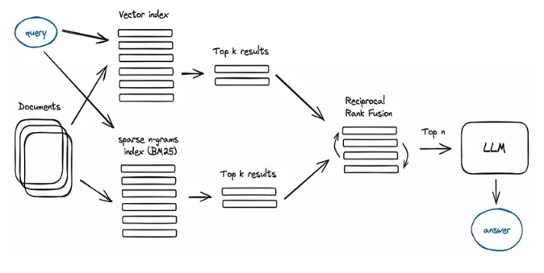

# Quy trình Xây dựng Chatbot RAG End-to-End (Tổng hợp 5 phần)

Trong kiến trúc của hệ thống Retrieval-Augmented Generation (RAG), giai đoạn chuẩn bị và ingest dữ liệu đóng vai trò quyết định đến độ chính xác và hiệu quả của các câu trả lời do mô hình ngôn ngữ lớn (LLM) sinh ra. Bài viết này trình bày chi tiết về quy trình kỹ thuật trong việc xây dựng pipeline ingest dữ liệu, từ khâu tiếp nhận tài liệu thô đến khâu lưu trữ trong cơ sở dữ liệu vector.

---

## 1. Phần 1 - Data Owner: Pipeline ingest dữ liệu


### 1.1. Tổng quan về kiến trúc pipeline

Quy trình ingest dữ liệu được thiết kế theo mô hình tuyến tính gồm ba giai đoạn chính:
1. **Tiếp nhận và Trích xuất (Loading):** Thu thập tài liệu từ các định dạng lưu trữ khác nhau.
2. **Phân đoạn Văn bản (Splitting):** Chia nhỏ dữ liệu nhằm tối ưu hóa khả năng truy xuất và tuân thủ giới hạn context window của LLM.
3. **Số hóa và Lưu trữ (Indexing):** Chuyển đổi văn bản thành các vector đặc trưng và lưu trữ vào Vector Database.

---

### 1.2. Chi tiết các bước thực hiện

#### 1.2.1. Tiếp nhận và trích xuất dữ liệu (Document Loading)

Để đảm bảo khả năng xử lý đa dạng các loại tài liệu như PDF, DOCX, Markdown và TXT, hệ thống sử dụng giải pháp nạp dữ liệu từ thư mục. Quy trình này được điều phối bởi các thành phần kỹ thuật sau:

*   **DirectoryLoader:** Thành phần chịu trách nhiệm quét và quản lý việc nạp dữ liệu từ một thư mục cụ thể trên hệ thống lưu trữ.
*   **UnstructuredFileLoader:** Một công cụ xử lý mạnh mẽ giúp trích xuất nội dung văn bản thuần túy từ nhiều định dạng tập tin khác nhau mà không làm mất đi thông tin văn bản cốt lõi.
*   **Glob Pattern:** Sử dụng bộ lọc mẫu để xác định chính xác các loại tập tin cần thu thập (ví dụ: tất cả các tập tin trong thư mục và thư mục con).
*   **Multithreading (Đa luồng):** Kỹ thuật cho phép hệ thống xử lý song song nhiều tập tin cùng một lúc. Điều này giúp tối ưu hóa tài nguyên phần cứng (CPU) và giảm thiểu đáng kể thời gian chờ đợi khi khối lượng tài liệu lên tới hàng trăm hoặc hàng nghìn tệp.

---

#### 1.2.2. Phân đoạn văn bản (Text Splitting)

Văn bản sau khi trích xuất thường quá dài để mô hình ngôn ngữ có thể xử lý hiệu quả trong một lần truy vấn. Do đó, việc chia nhỏ văn bản thành các đoạn (chunks) là bắt buộc, dựa trên các thuật toán phân tách thông minh:

*   **RecursiveCharacterTextSplitter:** Thuật toán phân đoạn văn bản theo hướng đệ quy. Thay vì cắt ngang văn bản một cách ngẫu nhiên, thuật toán này sẽ ưu tiên tìm kiếm các điểm ngắt tự nhiên như dấu xuống dòng của tiêu đề, đoạn văn hoặc dấu chấm câu. Điều này giúp giữ cho mỗi phân đoạn văn bản luôn mang một ý nghĩa hoàn chỉnh.
*   **Chunk Size (Kích thước đoạn):** Thông số xác định độ dài tối đa của mỗi đoạn văn bản sau khi chia. Việc lựa chọn kích thước phù hợp giúp AI dễ dàng xử lý mà không bị quá tải thông tin.
*   **Chunk Overlap (Độ gối đầu):** Một phần nội dung ở cuối đoạn trước sẽ được lặp lại ở đầu đoạn sau. Kỹ thuật này đóng vai trò như một "sợi dây liên kết" ngữ nghĩa, đảm bảo rằng thông tin quan trọng nằm ở biên giới giữa hai đoạn không bị mất đi ý nghĩa khi bị chia cắt.
*   **Separators (Dấu phân tách):** Các ký hiệu đặc biệt được định nghĩa trước (như định dạng tiêu đề Markdown, mã nguồn, hoặc các dấu xuống dòng) để hướng dẫn thuật toán nơi nên ưu tiên thực hiện việc ngắt đoạn.

---

#### 1.2.3. Số hóa và lưu trữ vector (Vector Indexing)

Đây là giai đoạn chuyển đổi trí tuệ của con người thành ngôn ngữ toán học mà máy tính có thể hiểu được thông qua quy trình định danh vector:

*   **OllamaEmbeddings:** Sử dụng mô hình ngôn ngữ (như Llama 3) để thực hiện tác vụ "nhúng" (embedding). Quá trình này chuyển hóa mỗi đoạn văn bản thành một chuỗi các con số (vector) đại diện cho ý nghĩa ngữ nghĩa của nó trong không gian đa chiều.
*   **Vector Store (Chroma):** Một cơ sở dữ liệu chuyên dụng để lưu trữ các vector này. Khác với cơ sở dữ liệu truyền thống tìm kiếm theo từ khóa chính xác, Vector Store cho phép tìm kiếm theo "ý nghĩa" (Similarity Search). Khi người dùng đặt câu hỏi, hệ thống sẽ tìm trong kho lưu trữ này những đoạn văn bản có vector gần giống nhất với ý đồ của câu hỏi đó.
*   **Persistence (Lưu trữ bền vững):** Thiết lập cơ chế lưu trữ dữ liệu vector xuống ổ đĩa vật lý, cho phép hệ thống có thể truy xuất lại dữ liệu đã xử lý bất cứ lúc nào mà không cần thực hiện lại quy trình số hóa từ đầu.

---

### 1.3. Đánh giá và kiểm thử

Sau khi hoàn tất quá trình lưu trữ, hệ thống sẽ thực hiện các truy vấn thực nghiệm để kiểm tra độ chính xác của các đoạn văn bản được trả về. Một pipeline chất lượng cao sẽ cho ra các kết quả có sự tương đồng lớn về mặt ý nghĩa với câu hỏi, từ đó cung cấp một ngữ cảnh đầu vào sạch và đầy đủ nhất cho mô hình ngôn ngữ lớn (LLM) để sinh câu trả lời.


## 2. Phần 2 - Embedding + Indexing Owner: Xây dựng chỉ mục để tìm đúng đoạn văn


Trong kiến trúc của hệ thống Chatbot RAG, phần việc của **Người 2 (Embedding + Indexing)** là chiếc cầu nối giữa dữ liệu đã ingest và tầng Retrieval. Nếu Người 1 lo “đưa tài liệu vào hệ thống và chuẩn hóa”, thì Người 2 chịu trách nhiệm biến những đoạn văn bản đó thành **vector có thể tìm kiếm được** và lưu chúng vào một **chỉ mục (index)** nhất quán, sẵn sàng cho việc truy xuất.

---

### 2.1. Embedding là gì và dùng để làm gì?

**Embedding** là quá trình biến mỗi đoạn văn (chunk) thành một vector số thực có kích thước cố định. Ý tưởng quan trọng:

- Các đoạn văn có nội dung **giống nhau về mặt nghĩa** sẽ có vector **gần nhau** trong không gian.
- Câu hỏi của người dùng cũng được embedding thành vector, để có thể so sánh với vector của từng chunk.

Bạn có thể hình dung embedding như việc “dịch một đoạn chữ sang tọa độ trong không gian nhiều chiều”. Khi người dùng đặt câu hỏi, hệ thống:

1. Chuyển câu hỏi thành một vector.
2. So sánh vector này với vector của tất cả chunk trong index.
3. Chọn ra những chunk có vector “gần” nhất (tức là có ý nghĩa tương đồng nhất).

Đây là nền tảng cho **semantic search** – tìm theo ý nghĩa thay vì chỉ dựa vào trùng từ khóa.

---

### 2.2. Vì sao phải có indexing?

Nếu chỉ có embedding mà không có indexing, mỗi lần người dùng hỏi, hệ thống sẽ phải:

- đọc lại toàn bộ tài liệu,
- chia chunk lại,
- embedding lại hết,
- rồi mới so sánh vector.

Điều này **rất chậm** và không thực tế khi số tài liệu lớn.

**Indexing** giải quyết vấn đề đó bằng cách:

- lưu sẵn:
  - `chunk_id` → `text` (đoạn nội dung gốc),
  - `chunk_id` → `vector` (vector embedding),
  - `source_id`, `source_name`, metadata khác (tài liệu nguồn là file nào, đường dẫn, thời điểm cập nhật…).
- tổ chức tất cả thông tin này thành một **snapshot index** mà Retrieval có thể tải lên và sử dụng ngay.

Trong project, phần index có thể được lưu ở dạng **JSON local** hoặc dùng backend như **Qdrant**. Dù cách lưu trữ thay đổi, tư duy cốt lõi vẫn là:

> “Mọi chunk trong hệ thống đều có vector, metadata rõ ràng, và được lưu vào một cấu trúc nhất quán để retrieval tra cứu nhanh.”

---

### 2.3. Nguyên tắc quan trọng: Nhất quán giữa embedding và index

Một yêu cầu mà Người 2 phải luôn để ý là **tính nhất quán**:

- Vector của chunk và vector của câu hỏi phải được sinh ra bởi **cùng một kiểu embedding**:
  - cùng mô hình (ví dụ: `llama3.1:8b`),
  - cùng backend (ví dụ: `ollama` hay một backend đơn giản khác).
- Nếu bạn đổi mô hình embedding mà **không** build lại index, các vector cũ và mới sẽ **không còn cùng hệ trục**, khiến việc so sánh trở nên kém ý nghĩa.

Trong tài liệu phân chia công việc, đây chính là phần:

- “Chốt mô hình embedding, số chiều vector…”
- “Chỉ mục được tạo đúng sau ingest; xóa/cập nhật không gây lệch index; có phương án rebuild rõ ràng…”

Nói cách khác, Người 2 phải kiểm soát:

- Khi nào cần **rebuild** toàn bộ index.
- Khi nào đủ để **sync** một phần (incremental update).

---

### 2.4. Vòng đời của index: Full rebuild và incremental sync

Trong thực tế, index không phải chỉ được tạo một lần rồi bỏ đó. Nó có cả một **vòng đời (lifecycle)**:

#### 2.4.1. Full rebuild – Xây lại chỉ mục từ đầu

Đây là thao tác “làm lại tất cả”:

- Quét toàn bộ thư mục `data_input`.
- Đọc nội dung từng file, chia chunk.
- Gọi Embedding để tạo vector cho **mọi** chunk.
- Ghi snapshot index mới, ghi đè snapshot cũ.

Full rebuild thường dùng khi:

- Lần đầu khởi tạo hệ thống.
- Thay đổi mô hình embedding (`embedding_model` đổi).
- Thay đổi logic chunking (cách tách đoạn, kích thước chunk…).
- Cần “làm sạch” lại dữ liệu index vì thay đổi lớn ở tầng ingest.

#### 2.4.2. Incremental sync – Cập nhật dần, không làm lại tất cả

Đây là thao tác giúp tiết kiệm thời gian và tài nguyên:

1. Quét thư mục `data_input` để lấy danh sách file hiện tại.
2. So sánh với snapshot index cũ:
   - Nếu file mới xuất hiện → add vào index.
   - Nếu file bị xóa → xóa các chunk tương ứng khỏi index.
   - Nếu file sửa đổi (thời gian `updated_at` khác) → chỉ re-embed và cập nhật các chunk của file đó.
3. Giữ nguyên chunk của các file không có thay đổi.

Incremental sync cho phép Người 2 đáp ứng yêu cầu trong tài liệu:

- “Chiến lược incremental update.”
- “Rebuild không rõ ràng là rủi ro cần chặn.”

Hệ thống vẫn nhanh, mà dữ liệu index vẫn đúng.

#### 2.4.3. Delete source – Xóa một tài liệu khỏi chỉ mục

Ngoài hai thao tác ở trên, Người 2 còn cần hỗ trợ:

- Xóa một `source_id` cụ thể khỏi index (khi người dùng muốn gỡ bớt tài liệu).
- Tự động xóa mọi chunk thuộc source đó.

Điều này giúp tránh phải rebuild toàn bộ chỉ vì muốn bỏ một vài tài liệu đơn lẻ.

---

### 2.5. Backend embedding trong project: Ollama + fallback

Trong `Conquer_AIO_ChatBotRAG`, Embedding được thiết kế để:

- **Ưu tiên dùng Ollama**:
  - Nếu endpoint `Ollama` sẵn sàng, hệ thống sẽ gọi API để sinh embedding thật.
  - Vector thu được thường có chất lượng ngữ nghĩa cao, phù hợp semantic search.
- **Fallback sang hashed embedding** khi môi trường local chưa đủ:
  - Dùng kỹ thuật hashing đơn giản để tạo vector có số chiều cố định.
  - Mục tiêu là:
    - Giữ cho **pipeline của Người 2 vẫn chạy được** trên mọi máy.
    - Tránh phụ thuộc nặng vào môi trường AI bên ngoài.

Đối với người mới:

- Hãy xem fallback như “bản demo” giúp hệ thống chạy end-to-end.
- Khi triển khai thật, bạn nên cấu hình embedding model “xịn” hơn (ví dụ Ollama với `llama3.1`).

---

### 2.6. Payload index và điểm bàn giao cho Retrieval (Người 3)

Khi index đã được xây xong, Người 2 cần đảm bảo:

- Snapshot index có đủ:
  - Thông tin về **sources** (mỗi file là một source, kèm tên file, đường dẫn, timestamp).
  - Danh sách **chunks**:
    - `source_id`, `source_name`,
    - `chunk_id`,
    - `text`,
    - `vector`.
  - Thông tin về `embedding_backend`, `embedding_model`, thời điểm `built_at`.

Đây chính là “hợp đồng bàn giao” từ lane 2 sang lane 3:

- Retrieval không cần biết chi tiết embedding làm sao.
- Retrieval chỉ cần:
  - một tập chunk có text + vector,
  - metadata đủ để lọc, debug, và reporting.

---

### 2.7. Tóm tắt dành cho người mới bắt đầu

Bạn có thể nhớ phần của Người 2 bằng 3 ý sau:

1. **Embedding**: Biến văn bản thành vector sao cho tương đồng về nghĩa → gần nhau trong không gian.
2. **Indexing**: Lưu trữ vector + metadata thành một snapshot có tổ chức, để retrieval tra cứu nhanh.
3. **Nhất quán & vòng đời**:
   - Khi đổi mô hình embedding hoặc logic chunking, cần rebuild.
   - Khi chỉ thêm/sửa/xóa một số tài liệu, dùng incremental sync.

Khi hiểu được lane 2, bạn sẽ thấy rõ hơn cách mà chatbot RAG “nhớ” nội dung tài liệu và tìm lại chúng trong vài trăm mili–giây khi người dùng đặt câu hỏi.


## 3. Phần 3 - Retrieval Owner: Thiết kế Hybrid Retrieval cho RAG Chatbot


### 3.1. Vai trò của retrieval trong project

<p align="center"></p>
<p align="center"><em>Hình 3.1. Retrival.</em></p>

Trong kiến trúc của project này, Retrieval là tầng đứng giữa **Indexing** và **RAG Core**:

1. Nhận `index snapshot` từ `IndexingService`.
2. Truy xuất các chunk liên quan nhất cho câu hỏi người dùng.
3. Xếp hạng lại để giảm nhiễu trước khi đưa vào prompt cho LLM.

Điểm bàn giao sang RAG Core nằm ở `app/rag_core/context/context_builder.py`: chỉ lấy ra các chunk cuối cùng với `source_id`, `source_name`, `chunk_id`, `text`, `score`.

### 3.2. Pipeline retrieval đã triển khai

Triển khai chính nằm trong `app/retrieval/hybrid/__init__.py` với class `HybridRetriever`.

#### 3.2.1. Build/refresh chỉ mục nội bộ cho retrieval

- Gọi `indexing_service.sync_index()` để đồng bộ dữ liệu mới nhất.
- Lấy snapshot bằng `get_index_snapshot()`.
- Chuẩn hóa dữ liệu chunk sang `IndexedChunk` (`chunk_id`, `source_id`, `source_name`, `text`, `vector`, `metadata`).
- Xóa exact duplicate bằng fingerprint `sha1(normalize_text(text))`.
- Rebuild thống kê cho kênh keyword: term frequency, IDF, average document length.

#### 3.2.2. Query expansion (mở rộng truy vấn)

Retriever có rule-based query expansion (`QUERY_EXPANSION_RULES`) để tăng recall cho các cụm domain cụ thể như:

- `giấy phép` -> `license`, `licensed`
- `khóa học` -> `course`, `curriculum`
- `mô đun/module` -> `resume`, `cover letter`, `interview`, ...

#### 3.2.3. Hybrid retrieval (Keyword + Vector)

Hybrid search là sự kết hợp giữa kết quả tìm kiếm được từ keyword search và kết quả của vector search. Ưu điểm to lớn của nó chính là: 

- Hiệu suất tìm kiếm: Sparse retrieval (keyword search) thường được sử dụng để tìm kiếm theo từ khóa và trả về các kết quả dựa trên độ tương đồng từ khoá. Trong khi đó, dense retrieval (vector search) sử dụng mô hình dữ liệu phức tạp hơn như mạng neural để đánh giá độ tương đồng giữa các văn bản.
- Độ chính xác: Sparse retrieval thường có độ chính xác cao trong việc đánh giá sự tương đồng giữa các từ khóa và văn bản, trong khi dense retrieval có thể cung cấp kết quả chính xác hơn bằng cách tính toán các biểu diễn mặc định hoặc được học từ dữ liệu.
- Đa dạng kết quả: Khi kết hợp cả sparse và dense retrieval, hệ thống có khả năng trả về một loạt các kết quả phong phú, từ các kết quả dựa trên từ khóa đến các kết quả dựa trên sự tương đồng ngữ nghĩa. Điều này giúp cung cấp thông tin đa dạng và phong phú hơn.
- Tính linh hoạt: Có thể điều chỉnh tỷ lệ giữa sparse và dense retrieval tùy thuộc vào yêu cầu cụ thể của ứng dụng hoặc loại dữ liệu.

##### 3.2.3.1. Keyword search

- Dùng BM25 lightweight tự cài đặt (`_keyword_search`), không phụ thuộc thư viện ngoài.
- Tokenization đi qua `normalize_text()` + regex `\w+` (file `app/retrieval/text_utils.py`).

##### 3.2.3.2. Vector search

Đây là kỹ thuật tìm kiếm nội dung bằng cách sử dụng vector embedding để tính similarity.

- Embedding query bằng `EmbeddingService.embed_query()` theo đúng backend đã dùng lúc indexing.
- Tính cosine similarity với vector của từng chunk (`_cosine_similarity`).

#### 3.2.4. Fusion bằng Weighted RRF

Hai kênh được hợp nhất bằng Reciprocal Rank Fusion có trọng số:

- `keyword_weight = 0.45`
- `vector_weight = 0.55`
- `rrf_k = 60`

Ý tưởng: chunk có thứ hạng cao ở bất kỳ kênh nào đều được cộng điểm, nên ổn định hơn so với chỉ dựa vào một score tuyệt đối.

#### 3.2.5. Giảm nhiễu trước khi rerank

1. **Near-duplicate removal** theo Jaccard token (`dedup_jaccard_threshold = 0.88`) trong cùng source.
2. **Candidate pool** giới hạn theo `rerank_pool_k`.

#### 3.2.6. Heuristic rerank

Reranker tại `app/retrieval/reranker/__init__.py` chấm điểm theo tổ hợp feature:

- `fused_norm`: điểm fusion đã chuẩn hóa
- `coverage`: độ phủ token query trong chunk
- `phrase_hit`: query chuẩn hóa có xuất hiện nguyên cụm trong chunk hay không
- `source_score`: độ phù hợp source theo rule
- `length_score`: ưu tiên chunk có độ dài phù hợp

Công thức tuyến tính hiện tại:

`final_score = 0.44*fused_norm + 0.22*coverage + 0.08*phrase_hit + 0.22*source_score + 0.04*length_score`

Ngoài boosting source đúng domain, hệ thống còn có **mismatch penalty** (`source_mismatch_penalty_factor = 0.15`) để phạt source sai khi query đã kích hoạt source hint.

#### 3.2.7. Threshold + source priority + fallback

- Lọc theo `min_context_score = 0.08`.
- Nếu sau lọc bị rỗng: fallback lấy top đầu từ reranked list để không trả về context rỗng.
- `source_priority_enabled = True`: khi query khớp rule source ưu tiên, hệ thống kéo source đúng domain lên trước nếu đạt `source_priority_min_score = 0.14`.

#### 3.2.8. Trả output cho RAG Core

Kết quả cuối là danh sách `RetrievedChunk` gồm:

- `chunk_id`, `source_id`, `source_name`, `text`
- `final_score`
- score thành phần: `fused_score`, `keyword_score`, `vector_score`
- rank theo từng kênh + `features` để debug

### 3.3. Cấu hình retrieval chính thức (default)

Khai báo tại `app/shared/configs/settings.py`:

- `retrieval_top_k = 5`
- `retrieval_candidate_top_k = 30`
- `retrieval_rerank_pool_k = 20`
- `retrieval_keyword_weight = 0.45`
- `retrieval_vector_weight = 0.55`
- `retrieval_rrf_k = 60`
- `retrieval_min_context_score = 0.08`
- `retrieval_dedup_jaccard_threshold = 0.88`
- `retrieval_source_priority_enabled = True`
- `retrieval_source_priority_min_score = 0.14`
- `retrieval_source_mismatch_penalty_factor = 0.15`
- `retrieval_debug = False`

Benchmark/quality gate:

- `retrieval_benchmark_top_k = 5`
- `retrieval_quality_hit_rate_threshold = 0.75`
- `retrieval_quality_mrr_threshold = 0.55`
- `retrieval_stability_runs = 2`

### 3.4. Benchmark và Definition of Done

Script benchmark: `app/retrieval/benchmark`.

Lệnh chạy:

```bash
python3 -m app.retrieval.benchmark --top-k 5 --output reports/retrieval_report.json
```

Report mẫu hiện có tại `Project/reports/retrieval_report.json`:

- `total_questions`: **31**
- `hit_rate_at_k`: **0.9355**
- `precision_at_k`: **0.4258**
- `mean_reciprocal_rank (MRR)`: **0.9032**
- `passes_quality_gate`: **true**
- `stable_across_runs`: **true** (`stability_runs = 2`)
- `miss_buckets`: `source_not_hit: 1`, `keyword_not_hit: 1`

### 3.5. Cơ chế debug hit/miss

Khi bật `debug=True`, `HybridRetriever` trả `RetrievalDebugInfo` gồm:

- Số lượng hit từng kênh: keyword/vector/fused
- Số chunk bị loại do dedup và threshold
- Top chunk ID ở từng stage
- Query variants đã dùng
- `miss_reason` nếu không có kết quả phù hợp

Các `miss_reason` chính trong code:

- `no_indexed_chunks`
- `no_keyword_or_vector_hits`
- `all_candidates_below_threshold`
- `vector_channel_empty`
- `keyword_channel_empty`
- `rerank_removed_all_candidates`

Ngoài ra benchmark layer còn gán thêm các bucket phân tích chất lượng như `source_not_hit`, `keyword_not_hit`, `relevant_chunk_outside_top_k`.

### 3.6. Kết luận từ góc nhìn Retrieval Owner

Phần retrieval của project đã đi theo hướng thực dụng cho MVP nhưng vẫn đủ chắc để mở rộng:

- Có **hybrid search** để cân bằng precision và semantic recall.
- Có **fusion + rerank + dedup + source-priority** để giảm nhiễu context.
- Có **benchmark + quality gate + stability check** để theo dõi chất lượng định lượng.


## 4. Phần 4 - RAG Core Owner: Ghép ngữ cảnh, thiết kế prompt và trả lời có citation


Nếu coi pipeline RAG là một dây chuyền, thì:

- Người 1 lo ingest và chuẩn hóa dữ liệu,
- Người 2 lo embedding + indexing,
- Người 3 lo retrieval (tìm đúng đoạn),
- **Người 4 (RAG Core)** là người “biên tập cuối”: ghép ngữ cảnh, viết prompt cho mô hình ngôn ngữ lớn (LLM), gọi model và trả về câu trả lời có **citation** rõ ràng.

---

### 4.1. Vai trò của RAG Core trong kiến trúc tổng thể

Về mặt luồng nghiệp vụ, RAG Core đứng sau Retrieval:

1. Người dùng đặt câu hỏi qua frontend.
2. Backend gọi Retrieval để lấy danh sách các chunk có liên quan nhất.
3. RAG Core:
   - ghép các chunk này thành **ngữ cảnh (context)**,
   - xây dựng một **prompt có cấu trúc**,
   - gọi LLM để sinh câu trả lời,
   - tạo danh sách **citation** để frontend hiển thị.

Điểm quan trọng: RAG Core **không cố gắng thay thế Retrieval**, mà tận dụng kết quả Retrieval để tạo ra **câu trả lời có căn cứ (grounded answer)**, bám sát nội dung tài liệu.

---

### 4.2. Ghép ngữ cảnh (Context Assembly)

Retrieval trả về một danh sách các chunk, mỗi chunk thường có:

- `source_id`, `source_name` – tài liệu nguồn,
- `chunk_id` – định danh của đoạn,
- `text` – nội dung đoạn,
- `score` – mức độ liên quan.

RAG Core cần:

1. Chọn ra một số chunk “đủ dùng” (top-k) để không vượt quá giới hạn context window của LLM.
2. Sắp xếp các chunk này thành một **block ngữ cảnh** rõ ràng, thường có:
   - nhãn [1], [2], …,
   - thông tin nguồn, chunk id, score,
   - nội dung text của từng chunk.

Mục tiêu của bước này:

- LLM có một vùng ngữ cảnh **đủ nhiều thông tin**, nhưng không bị “ngộp” vì quá dài.
- Người 4 kiểm soát được “thông tin nào được đưa vào prompt”.

---

### 4.3. Thiết kế prompt: Cách nói chuyện với LLM để tránh hallucination

Prompt là “bản hướng dẫn” cho LLM. Một prompt tốt thường có cấu trúc:

1. **Vai trò của model** – ví dụ:
   - “Bạn là trợ lý AI cho hệ thống RAG…”
   - “Hãy trả lời bám sát ngữ cảnh…”
2. **Câu hỏi (Question)** – chính là input của người dùng.
3. **Ngữ cảnh (Context)** – các chunk được retrieval chọn.
4. **Yêu cầu trả lời (Instructions)** – ví dụ:
   - Trả lời bằng tiếng Việt.
   - Ưu tiên dùng thông tin trong ngữ cảnh.
   - Nếu ngữ cảnh không đủ, phải nêu rõ mức độ không chắc chắn.
   - Không bịa thêm thông tin ngoài ngữ cảnh.

Những ràng buộc này là vũ khí chính để **giảm hallucination**:

- LLM được “khuyên” không nên bịa,
- được “ép” phải dựa trên nguồn đã cho,
- được “cho phép” nói “không chắc” nếu thiếu dữ liệu.

Về mặt lane trong tài liệu PDF, đây chính là:

- “Thiết kế prompt chính thức và cơ chế context assembly.”
- “Giảm hallucination bằng ràng buộc ngữ cảnh…”

---

### 4.4. Gọi mô hình (LLM Generation) và cơ chế timeout/fallback

Sau khi có prompt, RAG Core sẽ:

1. Gửi prompt đến LLM (ví dụ model chạy qua Ollama).
2. Đợi kết quả trả lời trong một khoảng thời gian giới hạn (timeout).

Nếu LLM trả lời kịp:

- Hệ thống lấy text trả lời làm `answer`.

Nếu LLM chậm hoặc lỗi (timeout):

- RAG Core trả về một **fallback an toàn**, ví dụ:
  - Thông báo model đang xử lý quá lâu.
  - Gợi ý người dùng thử với câu hỏi ngắn hơn hoặc giảm `top_k`.

Đây là phần rất quan trọng từ góc nhìn “Owner lane 4”:

- Không để hệ thống treo vĩnh viễn khi model phản hồi chậm.
- Luôn có một câu trả lời tử tế gửi lại frontend, giúp trải nghiệm người dùng mượt hơn.

---

### 4.5. Xây dựng citation: Giúp người dùng “kiểm chứng” câu trả lời

Một câu trả lời RAG tốt **không chỉ nói đúng** mà còn:

- chỉ ra **nó lấy căn cứ từ đâu**.

Đó là lý do lane 4 phải tạo ra danh sách **citation**. Mỗi citation thường chứa:

- `source_id`, `source_name` – nhận diện tài liệu gốc,
- `chunk_id` – đoạn cụ thể trong tài liệu,
- `score` – độ liên quan,
- `snippet` – một phần nội dung được rút gọn (ngắn, dễ đọc).

Lý do nên dùng **snippet thay vì full text**:

- UI sẽ gọn gàng hơn,
- người dùng có “preview” đủ để kiểm tra,
- nếu cần, họ vẫn có thể mở tài liệu gốc (mọi trường hợp đều biết rõ nguồn).

Trong project, citation chính là contract bàn giao từ RAG Core sang frontend:

- Backend trả về danh sách citation,
- Frontend render các thẻ citation để người dùng rê chuột và xem snippet.

---

### 4.6. Hợp đồng API với frontend: Cách lane 4 nói chuyện với UI

Từ góc độ frontend, endpoint chat (ví dụ `/api/v1/chat`) trả về một response chứa:

- `answer`: câu trả lời cuối cùng,
- `citations`: danh sách citation (nếu người dùng bật chế độ này),
- `model`: tên model LLM đang dùng,
- `latency_ms`: thời gian xử lý,
- `conversation_id`: mã cuộc hội thoại (giúp front lưu lịch sử).

Nhờ contract rõ ràng này:

- Frontend chỉ cần render đúng các field là có một UI chat hoàn chỉnh.
- Lane 4 có thể thay đổi “cách build prompt” hoặc “logic context” bên trong mà không làm vỡ giao diện.

---

### 4.7. Giảm hallucination: RAG Core làm gì ngoài prompt?

Prompt tốt là điều kiện cần, nhưng lane 4 còn có thể:

- Giới hạn số lượng chunk đưa vào LLM (tránh context lan man).
- Ưu tiên các chunk có score cao và nguồn đáng tin cậy.
- Thiết kế fallback khi:
  - Retrieval không trả về kết quả đủ tốt,
  - LLM không phản hồi hoặc phản hồi lỗi.

Về lâu dài, Người 4 có thể phối hợp với Người 3 và Người 5 để:

- Đặt ra chuẩn “grounded answer”,
- Xây dựng bộ câu hỏi demo để kiểm tra chất lượng,
- Gắn thêm log/benchmark để hiểu khi nào model hallucinate.

---

### 4.8. Tóm tắt phần việc của Người 4 cho người mới bắt đầu

Bạn có thể nhớ lane RAG Core bằng 4 từ khóa:

1. **Context** – nhận các chunk đã được retrieval sắp hạng và ghép thành block ngữ cảnh.
2. **Prompt** – viết một prompt rõ ràng, ràng buộc model phải bám sát ngữ cảnh.
3. **LLM** – gọi mô hình sinh câu trả lời, kèm cơ chế timeout và fallback an toàn.
4. **Citation** – trả về danh sách nguồn (snippet + metadata) để người dùng kiểm chứng.

Khi hiểu rõ vai trò của Người 4, bạn sẽ thấy pipeline RAG không chỉ là “gọi LLM với tài liệu”, mà là một luồng có trách nhiệm rõ ràng: **từ ngữ cảnh → prompt → câu trả lời có căn cứ**.


## 5. Phần 5 - Eval/DevOps + Frontend nhẹ Owner: Bảo đảm hệ thống chạy được end-to-end


Trong một dự án chatbot RAG thực tế, “chạy được từ đầu đến cuối” quan trọng không kém “thuật toán hay” hay “mô hình mạnh”. **Người 5 (Eval/DevOps + Frontend nhẹ)** chính là người:

- đảm bảo hệ thống có thể **chạy local** hoặc bằng **Docker**,
- có **kiểm thử tối thiểu** để tránh demo lỗi,
- và có một **giao diện web đủ dùng** để người mới có thể thử nghiệm nhanh.

---

### 5.1. Bức tranh tổng thể: Backend + Frontend trong repo GitHub

Trong repo, bạn có thể hình dung hệ thống gồm 3 “nhân vật” chính:

- **Frontend**: nơi người dùng tương tác (upload tài liệu, chat, xem citation).
- **Backend API**: điều phối toàn bộ pipeline ingest → retrieval → RAG Core.
- **LLM runtime** (ví dụ Ollama): nơi chạy mô hình tạo câu trả lời.

Điều làm hệ thống “có sức sống” không phải là stack công nghệ, mà là **dòng chảy trải nghiệm**:

> Người dùng tải tài liệu → hệ thống chuẩn bị tri thức → người dùng hỏi → hệ thống trả lời kèm nguồn → người dùng tin và dùng tiếp.

Vì vậy, Người 5 tập trung vào 2 chữ **tự tin** của người dùng:

1. **Tự tin hệ thống chạy được** (không lỗi vặt, không “đứng im”).
2. **Tự tin câu trả lời có căn cứ** (citation rõ, hành vi ổn định).

---

### 5.2. DevOps: Dùng Docker Compose để khởi chạy hệ thống

DevOps ở MVP không cần “cao siêu”, nhưng cần **đúng 3 nguyên tắc**:

1. **Tái lập được**: một máy mới làm theo hướng dẫn là chạy giống nhau.
2. **Có kiểm tra sẵn sàng (readiness)**: biết dịch vụ đã “lên” hay chưa, tránh vừa chạy vừa đoán.
3. **Giảm ma sát**: càng ít bước thủ công, càng ít lỗi do con người.

Docker Compose giải quyết đúng bài toán này: gói các dịch vụ (LLM + backend) vào một luồng khởi động rõ ràng, có healthcheck, có cấu hình môi trường.  
Chi tiết cách chạy (lệnh cụ thể) bạn xem ở **Phần 6** để phần này đỡ “khô”.

---

### 5.3. Health check: Làm sao biết backend đang “sống”?

Với người mới, một hệ thống đáng tin thường bắt đầu từ câu hỏi đơn giản:

> “Nó có đang chạy không?”

**Health check** là câu trả lời chuẩn hoá cho câu hỏi đó. Nó giúp:

- DevOps biết dịch vụ đã sẵn sàng để nhận request hay chưa.
- Frontend biết khi nào có thể gọi API mà không “đụng lỗi”.
- Nhóm demo biết khi nào có thể bắt đầu upload/ingest/chat.

Một health check “tử tế” thường trả về tối thiểu: trạng thái, thời gian, và thông tin model đang dùng — để tránh trường hợp “chạy rồi nhưng chạy sai cấu hình”.

---

### 5.4. Eval: Smoke test và system check cho RAG Chatbot

Đánh giá (Eval) ở MVP không phải là “đo điểm số model” ngay lập tức. Ở giai đoạn này, mục tiêu thực tế hơn là:

1. **Bảo vệ trải nghiệm demo**: tránh những lỗi cơ bản làm người dùng mất niềm tin.
2. **Bảo vệ pipeline tri thức**: ingest/index/retrieval/chat không bị “đứt đoạn”.

Vì vậy, smoke test/system check nên trả lời được các câu hỏi:

- Môi trường đã đủ chưa (Python/Node, thư viện cần thiết)?
- LLM có kết nối được không?
- Backend có lên không?
- Có dữ liệu để ingest không?
- Khi gọi chat, có trả về được answer + citations không?

Tư duy ở đây giống như “kiểm tra điện nước trước khi mở quán”: không hào nhoáng, nhưng quyết định bạn có bán được hay không.

---

### 5.5. Frontend: Giao diện chat và quản lý tài liệu cho người mới

Frontend “nhẹ” không có nghĩa là sơ sài. Nó chỉ có nghĩa là:

- tập trung vào **3 hành vi cốt lõi** của người dùng,
- và làm 3 hành vi đó thật rõ ràng, ít rối, ít bước.

Ba hành vi đó là:

1. **Đưa tri thức vào hệ thống** (upload tài liệu).
2. **Hỏi và nhận câu trả lời** (chat).
3. **Tin tưởng và kiểm chứng** (xem citations/snippets).

Về mặt UX cho người mới, có 3 chi tiết rất “đáng tiền”:

- **Trạng thái rõ ràng**: đang tải lên, đang ingest, đang trả lời…
- **Fallback thân thiện**: khi lỗi xảy ra, nói rõ người dùng nên làm gì tiếp theo.
- **Citation dễ đọc**: không nhồi quá nhiều text, chỉ cần snippet + nguồn là đủ tạo niềm tin.

---

### 5.6. Tích hợp API: Cách frontend giao tiếp với backend

Điểm quan trọng trong tích hợp không nằm ở “có bao nhiêu endpoint”, mà nằm ở **contract ổn định**:

- Frontend cần biết: gửi gì, nhận gì, và khi lỗi thì nhận cấu trúc lỗi ra sao.
- Backend cần giữ: format response nhất quán để UI hiển thị được.

Đối với người mới, chỉ cần nhớ 4 luồng API cơ bản:

1. **Health**: kiểm tra hệ thống sẵn sàng.
2. **Upload/Ingest**: đưa tài liệu vào và chuẩn bị tri thức.
3. **Chat**: hỏi và nhận answer.
4. **Citations/History**: xem lại bằng chứng và lịch sử.

Các chi tiết gọi API và chạy thực tế đã được đưa sang **Phần 6** để phần này tập trung vào tư duy.

---

### 5.7. End-to-end flow: Từ góc nhìn người dùng cuối

Luồng end‑to‑end nên được kể như một câu chuyện “người dùng đi từ 0 đến có niềm tin”:

1. **Bắt đầu**: hệ thống báo sẵn sàng (health ok).
2. **Nạp tri thức**: người dùng đưa tài liệu vào (upload/ingest).
3. **Hỏi đáp**: người dùng đặt câu hỏi và thấy câu trả lời xuất hiện mượt (streaming).
4. **Kiểm chứng**: người dùng nhìn citation và thấy “à, câu này lấy từ tài liệu mình vừa đưa vào”.
5. **Lặp lại**: người dùng thử câu hỏi khác, hoặc thay tài liệu khác, hệ thống vẫn ổn định.

Chỉ khi người dùng đi trọn vòng này, họ mới thật sự tin “đây là chatbot hỏi đáp trên tài liệu”, chứ không phải một chatbot trả lời chung chung.

---

### 5.8. Tóm tắt phần việc của Người 5 cho người mới bắt đầu

Bạn có thể gói gọn lane 5 trong 3 ý:

1. **Eval** – có smoke test, system check để đảm bảo “mọi mảnh ghép đều đang chạy”.
2. **DevOps** – chuẩn hóa cách khởi động hệ thống (Docker, healthcheck, hướng dẫn môi trường).
3. **Frontend nhẹ** – cung cấp một UI đơn giản nhưng đầy đủ:
   - upload tài liệu,
   - theo dõi ingest/integration,
   - chat với tài liệu và xem citation.

Nhờ Người 5, dự án chatbot RAG không chỉ “đẹp trên giấy” mà thực sự trở thành một sản phẩm người mới có thể chạy, dùng và đánh giá chất lượng end‑to‑end.


## 6. Hướng dẫn nhanh để chạy project (VN)

### 6.1. Chạy bằng Docker (đề xuất cho demo nhanh)

Yêu cầu:

- Đã cài **Docker** và **Docker Compose**.

Các bước:

1. Mở terminal tại thư mục `Project/` trong repo.
2. Chạy lệnh:

   ```bash
   cd Project
   docker compose -f docker/docker-compose.yml up -d
   ```

3. Đợi đến khi:
   - Container **Ollama** healthy (pull xong model),
   - Container **API** healthy (check `/health` OK).
4. Kiểm tra backend:

   - Mở `http://localhost:8000/health` trên trình duyệt.
   - Nếu thấy `status: ok` → backend đã chạy.

5. Chạy frontend:

   ```bash
   cd ../frontend
   npm install
   npm run dev
   ```

6. Mở `http://localhost:3000` để vào giao diện chat, upload tài liệu và hỏi đáp.

### 6.2. Chạy local không dùng Docker

Yêu cầu:

- Python 3.11+, Node.js 16+.

Bước 1 – Cài môi trường backend:

```bash
cd Project
python -m venv venv
venv\Scripts\activate  # Windows
# hoặc source venv/bin/activate trên macOS/Linux

pip install -r requirements.txt
```

Bước 2 – Chạy Ollama và kéo model:

```bash
ollama serve
ollama pull llama3.1:8b
```

Đảm bảo Ollama lắng nghe ở `http://localhost:11434`.

Bước 3 – Chạy API FastAPI:

```bash
cd Project
python -m uvicorn app.api.main:app --host 0.0.0.0 --port 8000 --reload
```

Kiểm tra:

- Mở `http://localhost:8000/health` → thấy `status: ok`.
- Mở `http://localhost:8000/docs` → Swagger UI.

Bước 4 – Chuẩn bị dữ liệu và ingest:

1. Tạo thư mục `data_input/` (nếu chưa có) trong `Project/`.
2. Đặt các file tài liệu (PDF/DOCX/TXT/MD) vào `data_input/`.
3. Có thể dùng API ingest (ví dụ `POST /api/v1/ingest`) hoặc chạy script CLI indexing (nếu có) để build index.

Bước 5 – Chạy frontend:

```bash
cd ../frontend
npm install
npm run dev
```

Mặc định frontend gọi backend ở `http://localhost:8000`. Nếu bạn đổi port, hãy chỉnh lại biến môi trường tương ứng (`VITE_API_URL` hoặc tương đương) trong frontend.

Sau khi hoàn thành các bước trên, bạn đã có thể:

- Upload tài liệu,
- Ingest/index,
- Đặt câu hỏi và xem câu trả lời có citation trực tiếp trên giao diện web.


## 7. Tài liệu tham khảo


- FastAPI: `https://fastapi.tiangolo.com/`
- Vite: `https://vitejs.dev/guide/`
- Tailwind CSS: `https://tailwindcss.com/docs`
- Ollama: `https://ollama.com/`
- LangChain: `https://python.langchain.com/`


